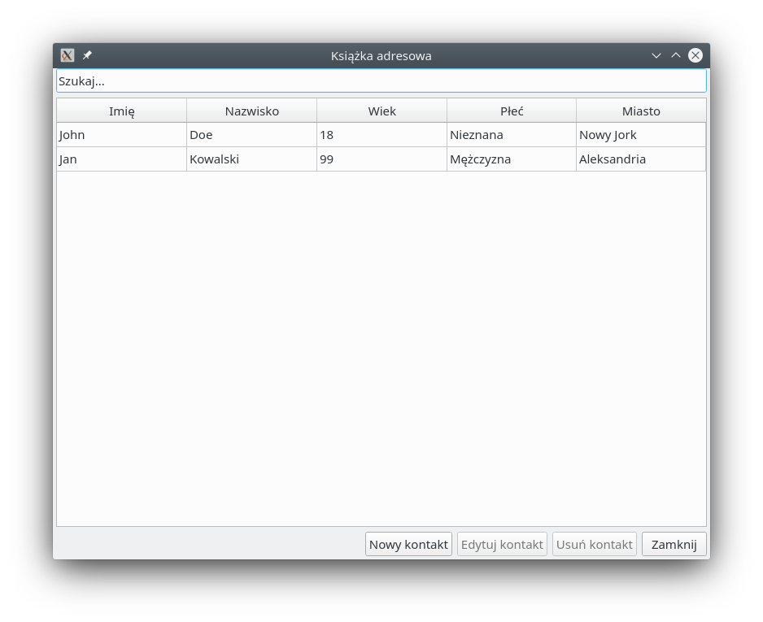
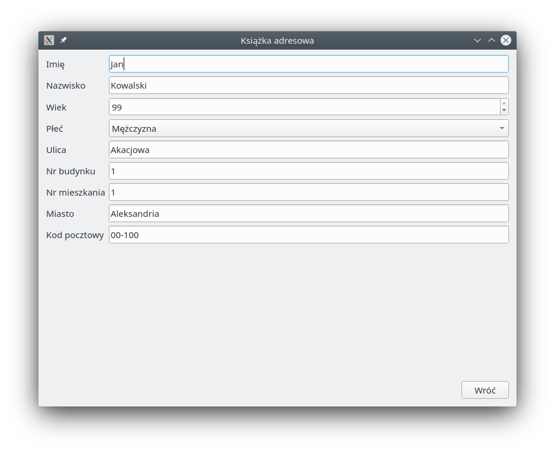
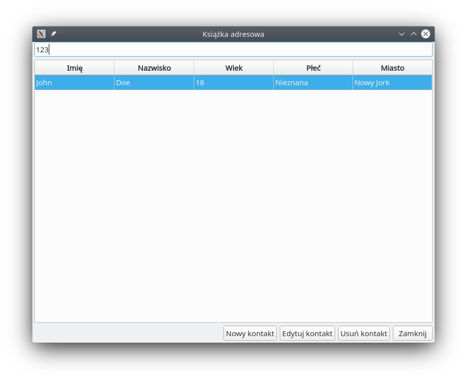

# Program do zarządzania kontaktami

## Instalacja

Zainstaluj [poetry](https://python-poetry.org/docs/#installation).

Zainstaluj projekt:

```
poetry install
```

## Uruchamianie

Do uruchomienia projektu można wykorzystać poetry:

```
poetry run addressbook -f sample_contacts.yaml
```

`addressbook` rozumie jedną flagę, `-f`/`--file`, wskazującą na plik zawierający dane kontaktów. Plik nie musi istnieć. `sample_contacts.yaml` w tym katalogu jest przykładowym plikiem z dwoma kontaktami.

Alternatywnie można aktywować środowisko wirtualne z zainstalowanym pakietem i uruchomić `addressbook` bezpośrednio:

```
. ~/.cache/pypoetry/virtualenvs/addressbook-*/bin/activate
addressbook -f sample_contacts.yaml
```

## Użycie

Główne okno zawiera listę kontaktów odczytanych z pliku.



Zaznaczone kontakty można usuwać oraz edytować. Przycisk "Nowy kontakt" przechodzi do trybu tworzenia kontaktu.



Pole tekstowe na górze ekranu umożliwia filtrowanie rekordów w tabeli. Po wpisaniu dowolnej frazy, wyświetlone zostaną jedynie kontakty które zawierają tę frazę w dowolnym polu (wliczając w to pola niewidoczne w tabeli, takie jak kod pocztowy). Dopasowanie zawsze jest wykonywane z uwzględnieniem wielkości znaków. Filtrowanie bez uwzględnienia wielkości znaków, jedynie na wybranych polach, negatywne ("wszystko oprócz"), korzystając ze znaków dopasowania lub wyrażeń regularnych nie jest możliwe.



Dodanie/edycja/usunięcie kontaktu powoduje natychmiastowe zapisane aktualnych danych na dysku. Zapis jest operacją atomową i jest zaimplementowany poprzez zapisanie danych w nowym pliku tymczasowym, a następnie nadpisanie pliku głównego plikiem tymczasowym. W ten sposób unika się utworzenia wadliwego lub niepełnego pliku w przypadku błędu podczas zapisu.
